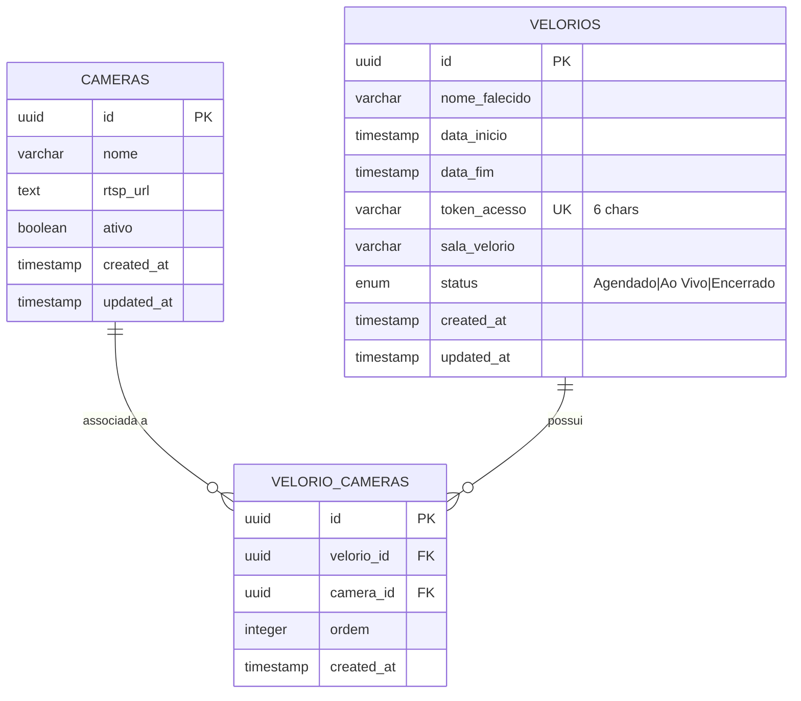
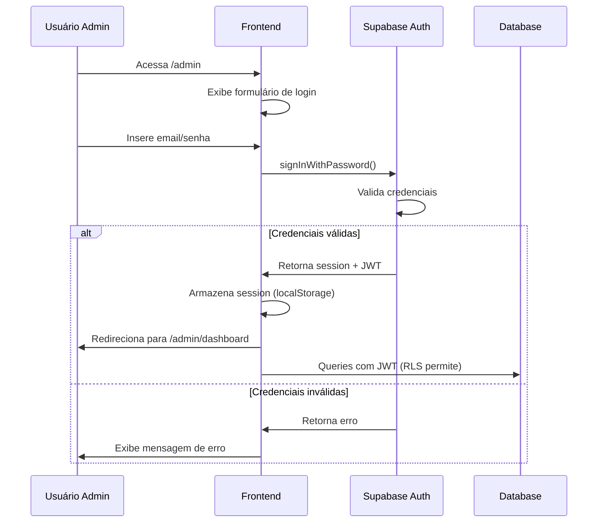
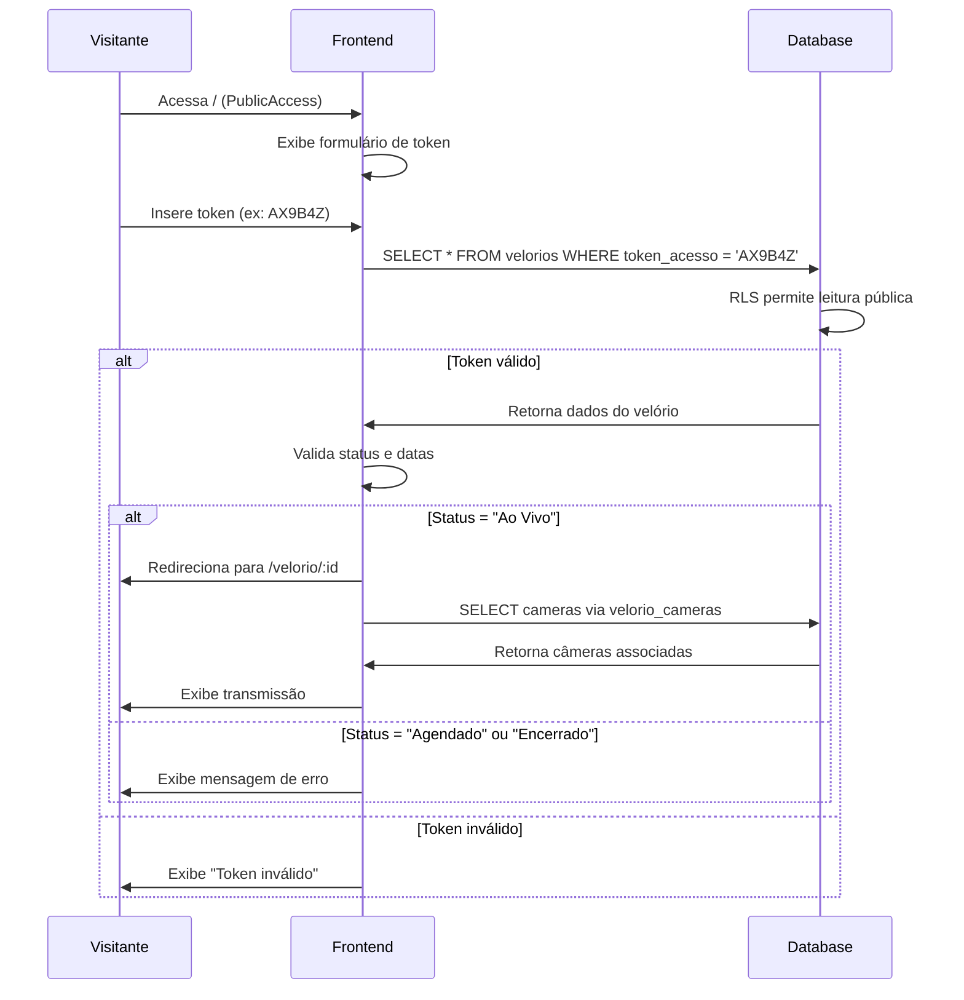
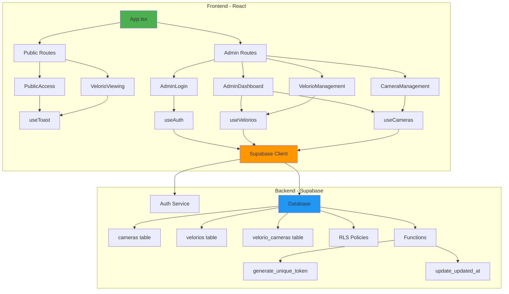
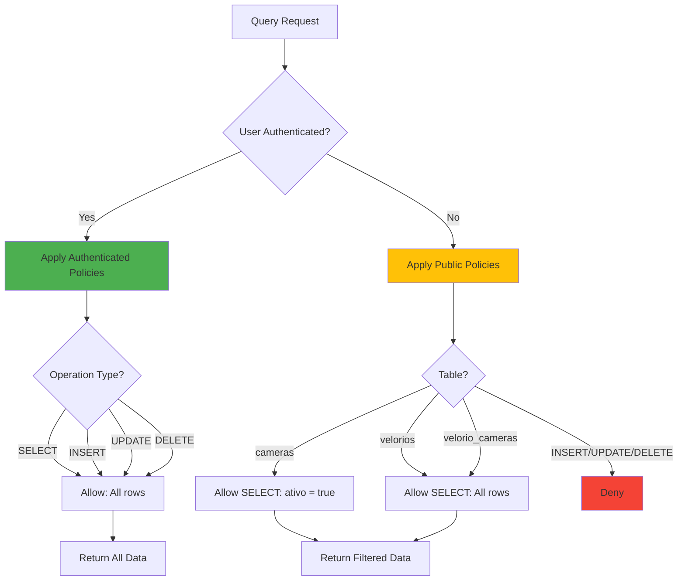
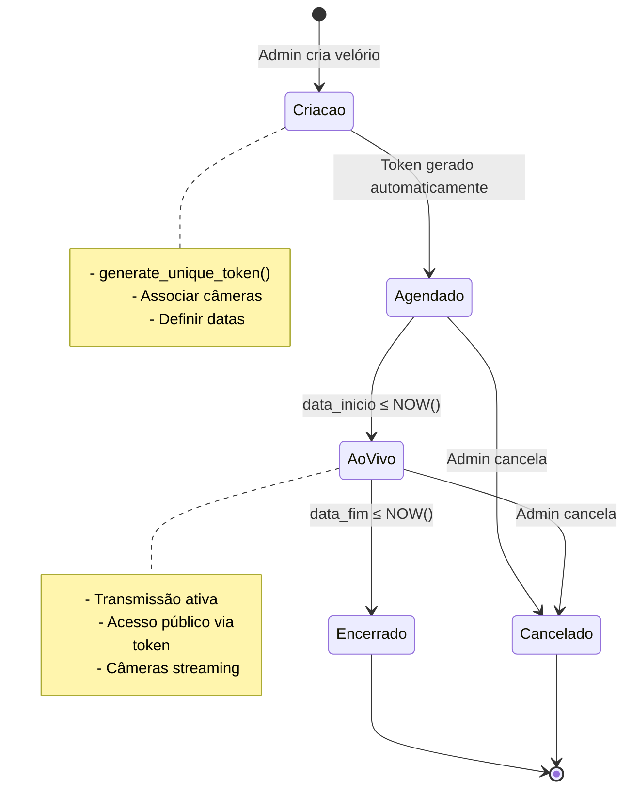
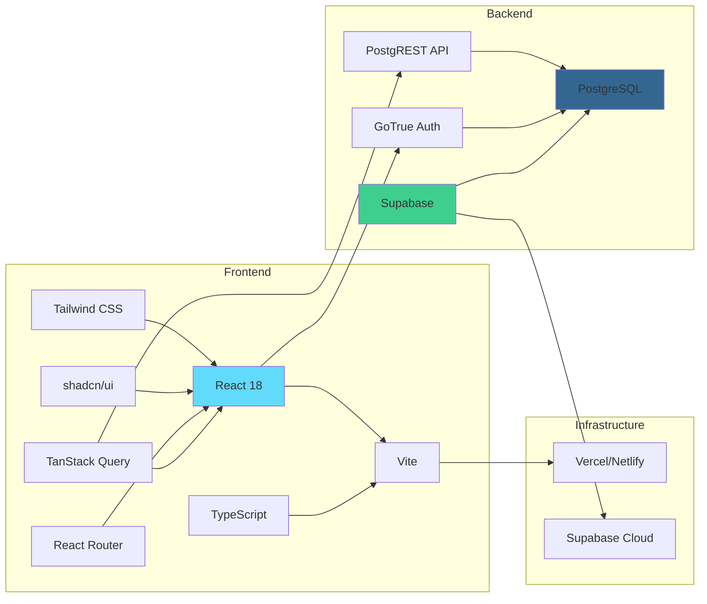

# Diagrama de Arquitetura - Eternal Streams

## Estrutura do Banco de Dados

## Fluxo de Autenticação

## Fluxo de Acesso Público

## Arquitetura de Componentes

## Row Level Security (RLS) Flow

## Fluxo de Gerenciamento de Velórios

## Stack Tecnológico Completo

